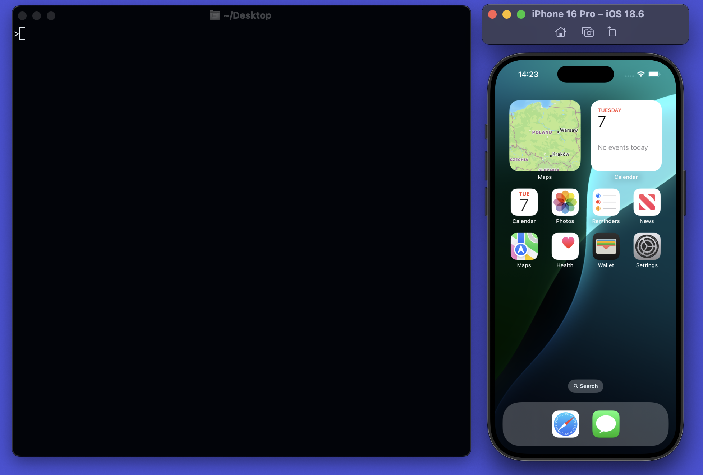

<p align="center">
  
</p>

# Argent

Argent is an **agentic toolkit** that gives your AI assistant direct access to iOS Simulators. Ask it to tap a button, run a profiler or reproduce an issue manually - all from within your CLI, without switching context.

```bash
npx @swmansion/argent init
```

<p align="center">
  
</p>

---

## Capabilities

- **Autonomous iOS development** - Allow your agent to work with iOS apps on its own - let it build, open, interact with the app and debug it. Ask for reproducing issues, testing features manually, profiling your app and much more, without ever interrupting your work.
- **UI interaction** - Give your agent full control toolkit - tapping, swiping, pinching, typing, gestures, hardware buttons and all other gears included. Let it navigate your app exactly as a user would, without lifting a finger.
- **Profiling with batteries included** - Argent can perform and analyze both React-Native and Xcode Instruments profiling sessions. Get comprehensive summaries and ask to optimise your app where you find fit.
- **Debugging and diagnostics** - Let your agent inspect logs, capture crash reports, and reproduce failing states on the simulator, so you can jump straight to the fix.
- **React Native out of the box** - Argent works with React Native apps natively, so your agent can build, launch, and iterate on your RN project the same way it would any iOS app - no extra setup required.

> **Tip:** Once installed, ask your assistant _"What can Argent do?"_ - it will walk you through all capabilities available.

---

## Installation

#### Prerequisites

- macOS with **Xcode** installed
- **Node.js 18** or later

#### Run `init` in your project

From your project root:

```bash
npx @swmansion/argent init
```

This command triggers an installation wizard which:

- Installs `@swmansion/argent` globally
- Detects your editor and registers the MCP server
- Copies skills, rules, and agent definitions into your workspace

Prefer a manual install?

```bash
npm install -g @swmansion/argent
argent init
```

---

## CLI Reference

| Command         | Description                                                 |
| --------------- | ----------------------------------------------------------- |
| `argent init`   | Install globally and configure MCP in the current workspace |
| `argent update` | Pull the latest version and refresh workspace configuration |
| `argent remove` | Unregister the MCP server and uninstall the package         |

---

## Supported Editors

`argent init` auto-detects and configures MCP for:

| Editor      | Config location                                               |
| ----------- | ------------------------------------------------------------- |
| Claude Code | `.mcp.json` (project) or `~/.claude.json` (global)            |
| Cursor      | `.cursor/mcp.json` (project) or `~/.cursor/mcp.json` (global) |
| VS Code     | `.vscode/mcp.json`                                            |
| Windsurf    | `.windsurf/mcp.json`                                          |
| Zed         | `.zed/settings.json`                                          |
| Gemini CLI  | `.gemini/settings.json`                                       |
| Codex CLI   | `.codex/config.yaml`                                          |

---

## License

Argent uses a mixed licensing model.

**Source code** is released under the [Apache License 2.0](LICENSE).

**Proprietary binaries** (`bin/simulator-server` and the `.dylib` files in `native-devtools-ios`) are the intellectual property of Software Mansion S.A. and are licensed solely for use within this project. Decompiling, reverse-engineering, or redistributing them without explicit written permission is prohibited.

By using argent you acknowledge and agree to this structure.

---

Made by [Software Mansion](https://swmansion.com)
